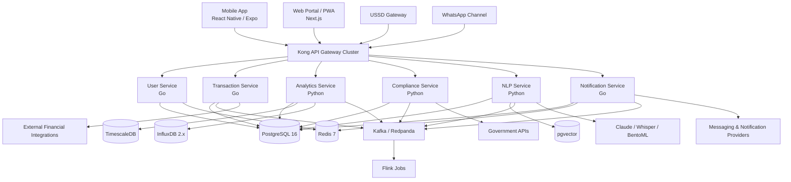

# ARCHITECTURE.md

## BizPulse AI System Architecture

**Document Type:** Canonical Architecture Overview  
**System:** BizPulse AI  
**Version:** 1.0  
**Status:** Authoritative implementation reference  
**Last Updated:** March 19, 2026

---

## 1. Purpose

This document defines the canonical system architecture for BizPulse AI. It is intended to be the primary architectural reference for engineers, AI coding agents, technical leads, DevOps engineers, compliance stakeholders, and product leadership.

It describes:

- the major system components and their responsibilities
- how user-facing channels interact with the platform
- how the microservices, data systems, AI stack, and integration layer fit together
- the infrastructure topology for local, staging, and production environments
- the architectural constraints that must remain fixed unless superseded by a formal ADR

This document should be read together with:

- `CLAUDE.md`
- `docs/DATA_MODEL.md`
- `docs/API_CONTRACT.md`
- `docs/COMPLIANCE_MATRIX.md`
- `docs/OFFLINE_SYNC_SPEC.md`
- `docs/SECURITY_BASELINE.md`
- `docs/DECISIONS.md`

---

## 2. Architecture Principles

BizPulse AI is governed by the following architectural principles:

1. **Offline-first by default**  
   The platform must remain usable under intermittent or low-quality connectivity. Local-first state, queue-based sync, and deterministic reconciliation are required.

2. **Compliance-aware by design**  
   Ghanaian regulatory, tax, payroll, privacy, and audit obligations are first-class constraints, not post-build add-ons.

3. **Event-driven financial core**  
   Financial data is append-only and idempotent. Critical transaction workflows must be modeled as immutable events.

4. **Mobile-first, channel-diverse delivery**  
   Mobile app, PWA, USSD, and WhatsApp are all strategic channels. Architecture must support consistent business logic across channels.

5. **API gateway enforcement at the edge**  
   Authentication, routing, rate limiting, and gateway-level policy enforcement happen at Kong.

6. **Service ownership by bounded context**  
   Domain responsibilities are isolated by service boundaries, with explicit API and event contracts.

7. **Operational resilience over convenience**  
   HA topology, retries, dead-letter queues, health checks, DR readiness, and fallback routing are mandatory where outages would materially impact SMEs.

8. **Configuration over code for regulatory variables**  
   Tax rates, filing windows, thresholds, and compliance parameters must be stored in managed configuration, not hardcoded.

9. **Production data residency discipline**  
   Primary data must reside in AWS `af-south-1`; cross-region replication is DR-only unless a separate legal and security approval exists.

10. **AI as subsystem, not whole system**  
    AI features are integrated into the product through explicit service boundaries, auditability, and fallback behavior; they do not bypass platform controls.

---

## 3. System Context

BizPulse AI is an enterprise-grade, multilingual, offline-capable business operating system for Ghanaian SMEs. It combines transaction ingestion, analytics, compliance automation, AI advisory, multilingual NLP, and multi-channel delivery into a single platform.

### 3.1 Primary user-facing channels

- **Mobile App** — React Native (Expo), primary rich-client channel
- **Web Portal / PWA** — Next.js PWA for browser-based access and low-friction onboarding
- **USSD** — low-connectivity and low-literacy access channel
- **WhatsApp Business API** — conversational interaction and notifications

### 3.2 Major external ecosystems

- Mobile money providers: MTN MoMo, Vodafone Cash, AirtelTigo
- Banks and payment rails: GhIPSS and partner bank feeds
- Government and compliance bodies: GRA, SSNIT, DPC, BoG, NCA
- Messaging and channel providers: direct telco APIs, Africa's Talking, WhatsApp Business
- AI and ML providers/tooling: Anthropic Claude API, Whisper, MLflow, BentoML

---

## 4. Logical Architecture Overview



---

## 5. Channel Layer

### 5.1 Mobile App

**Technology:** React Native with Expo SDK 52+  
**Purpose:** Primary day-to-day operational client for SME users.

Responsibilities:

- onboarding and authentication flows
- transaction review and business activity dashboards
- offline capture of operational records
- sync queue presentation and conflict resolution UX
- AI assistant access (voice and text)
- compliance reminders and filing workflows
- push notifications and in-app alerts

Required characteristics:

- encrypted SQLite with WAL support
- robust offline cache and mutation queue
- resumable sync after prolonged offline periods
- low-end Android device optimization
- OTA updates for JavaScript and assets only via Expo EAS Update

### 5.2 Web Portal / PWA

**Technology:** Next.js 15+ with TypeScript, PWA support  
**Purpose:** Browser-based access for dashboards, admin surfaces, and desktop-oriented workflows.

Responsibilities:

- admin and business management surfaces
- document review and reporting workflows
- responsive analytics and KPI dashboards
- onboarding, subscription, and settings management
- browser-accessible fallback for users without the app

### 5.3 USSD Channel

**Purpose:** Primary access path for low-connectivity and low-literacy users.

Responsibilities:

- balance and transaction summaries
- guided compliance reminders
- simple operational commands and confirmations
- short-path workflow completion within strict screen limits

Constraints:

- must tolerate telco instability
- must preserve state across session boundaries where needed
- must degrade gracefully when downstream services are delayed

### 5.4 WhatsApp Channel

**Purpose:** Conversational interface for assistance, reminders, lightweight workflows, and business messaging.

Responsibilities:

- advisory prompts and reminders
- customer interaction automations
- notification and conversational escalation path
- multilingual support via NLP routing

---

## 6. API Gateway Layer

**Technology:** Kong HA cluster, PostgreSQL-backed configuration  
**Topology:** Minimum three instances from Sprint 1 in non-local environments

Gateway responsibilities:

- request routing to internal services
- JWT validation at gateway boundary
- rate limiting and abuse protection
- request/response policy enforcement
- observability hooks and tracing propagation
- circuit breaker and upstream protection behavior

### 6.1 Gateway rules

- Kong validates JWTs issued by Keycloak.
- Internal services trust verified identity claims propagated from Kong.
- No production single-instance Kong deployment is allowed.
- Gateway policies must be version-controlled under `services/api-gateway-config/`.

---

## 7. Identity and Access Management

**Identity Provider:** Keycloak  
**Protocol:** OAuth 2.0 / OpenID Connect

Responsibilities:

- user authentication
- token issuance and refresh
- tenant-aware identity mapping
- RBAC and role claim propagation
- session and realm administration

### 7.1 Security model

- short-lived JWTs at the edge
- service authorization based on verified claims and tenant scope
- field-level protection for sensitive PII in persistence layers
- auditable consent, access, and compliance actions

---

## 8. Core Microservices

BizPulse AI is implemented as a microservices architecture organized by domain boundary.

### 8.1 User Service (Go)

**Domain:** Identity-adjacent business logic and tenant administration

Responsibilities:

- user registration and onboarding orchestration
- business and tenant management
- consent tracking hooks
- subscription and entitlement state
- user preferences and profile settings
- relationship to identity provider metadata

Primary dependencies:

- Keycloak
- PostgreSQL
- Redis
- Notification Service

### 8.2 Transaction Service (Go)

**Domain:** Financial transaction ingestion and immutable business event recording

Responsibilities:

- ingest raw transaction data from providers and manual entry flows
- enforce append-only transaction model
- generate and validate idempotency keys
- normalize financial events into canonical format
- publish transaction events to Kafka
- serve transaction history and ledger views

Primary dependencies:

- PostgreSQL
- Kafka
- external payment and bank integrations
- Redis / Asynq for outbound provider interactions where applicable

### 8.3 Analytics Service (Python)

**Domain:** Predictive and descriptive analytics

Responsibilities:

- cash flow forecasting
- demand prediction
- credit risk scoring
- operational KPI aggregation
- metric generation for dashboards and alerts
- consume streaming and historical business data for model inference

Primary dependencies:

- PostgreSQL / TimescaleDB
- InfluxDB
- Kafka / Flink outputs
- MLflow and model serving components

### 8.4 Compliance Service (Python)

**Domain:** Regulatory reporting, tax logic, filing support, and audit artifacts

Responsibilities:

- VAT, PAYE, SSNIT, and related compliance workflows
- maintain filing schedules and compliance status
- generate regulatory artifacts and reports
- consume configurable tax and policy tables
- maintain audit-ready history of regulatory actions

Primary dependencies:

- PostgreSQL
- government integrations
- notification triggers
- document generation stack

### 8.5 NLP Service (Python)

**Domain:** Multilingual language processing and AI assistant orchestration

Responsibilities:

- query routing between simple and complex model paths
- prompt orchestration and retrieval augmentation
- multilingual text and voice processing
- code-switching and localized business terminology handling
- conversational response shaping with auditability

Primary dependencies:

- pgvector
- Anthropic Claude API
- Whisper
- BentoML / model serving utilities
- PostgreSQL for metadata and traces

### 8.6 Notification Service (Go)

**Domain:** Outbound communications and delivery orchestration

Responsibilities:

- push, SMS, WhatsApp, and reminder dispatch
- provider-normalized delivery tracking
- alert and escalation workflows
- delivery retries and dead-letter workflows
- channel preference enforcement

Primary dependencies:

- Redis / Asynq
- external messaging providers
- PostgreSQL
- Kafka events

---

## 9. Data Architecture

BizPulse AI uses a polyglot persistence model with clear storage responsibilities.

### 9.1 PostgreSQL 16

**Role:** Primary transactional system of record

Stores:

- users
- businesses / tenants
- append-only transactions
- subscriptions and entitlements
- consent records
- compliance records and filing history
- configuration tables including compliance rates
- metadata for AI operations, audit references, and document registries

### 9.2 TimescaleDB

**Role:** Time-series extension on PostgreSQL for business metrics and analytical rollups

Stores:

- daily revenue metrics
- daily cash flow series
- user activity metrics
- time-bucketed business signals for analytics and dashboards

### 9.3 pgvector

**Role:** Default vector store for RAG and semantic retrieval

Stores:

- document embeddings
- knowledge snippets
- semantic retrieval metadata
- multilingual retrieval vectors for assistant workflows

Constraint:

- pgvector is the production default.
- Pinecone is not to be scaffolded for production use unless a formal ADR supersedes this after DPIA approval.

### 9.4 Redis 7

**Role:** High-speed ephemeral state and queue backing

Stores / supports:

- caching
- session-adjacent short-lived state
- rate limiting counters
- distributed locks where justified
- Asynq task queues and retry state

### 9.5 InfluxDB 2.x

**Role:** Infrastructure and telemetry metrics store

Stores:

- service operational metrics
- delivery and retry metrics
- failover signals
- custom observability metrics for queueing, latency, and incidents

### 9.6 Object storage

**Platform:** S3-compatible storage on AWS  
**Role:** Durable object and archive storage

Stores:

- generated reports and PDF/A documents
- raw import/export artifacts
- long-term data lake exports such as Parquet
- audit bundles and evidence archives

---

## 10. Eventing and Streaming Architecture

**Technology:** Kafka-compatible event backbone, Avro schemas, Flink stream processing

### 10.1 Eventing goals

- decouple ingest, enrichment, analytics, and notification workloads
- preserve reliable event-driven propagation of business changes
- support replay, enrichment, and downstream analytics
- standardize integration contracts across services

### 10.2 Event rules

- every topic must have a registered Avro schema
- events must include idempotency keys where required
- timestamps must be explicit and normalized
- enrichment flows must be deterministic and auditable

### 10.3 Typical flow

1. raw transaction or business event ingested
2. canonical event published to Kafka
3. enrichment and stream processing executed in Flink
4. downstream services consume enriched events
5. analytics, notifications, and compliance actions are triggered as applicable

---

## 11. AI / ML Architecture

BizPulse AI contains both predictive ML and generative AI capabilities.

### 11.1 Predictive ML layer

Includes:

- cash flow forecasting
- demand prediction
- credit scoring
- supplier and business risk signals

Supporting tooling:

- MLflow for experiment and model tracking
- BentoML or equivalent packaging/serving path
- training and evaluation assets under `/ml/`

### 11.2 NLP and assistant layer

Model routing rules:

- complex NLP path: `claude-sonnet-4-6`
- lightweight/simple query path: `claude-haiku-4-5-20251001`

Capabilities:

- multilingual support for Ghanaian English, Twi, Ga, Ewe, Hausa, and Dagbani
- code-switch detection and localized business vocabulary handling
- voice-first interactions for low-literacy scenarios
- retrieval-augmented responses against approved internal corpora

### 11.3 AI controls

- model versions are pinned until formal release review
- prompts and retrieval sources must be auditable
- compliance-sensitive outputs require deterministic validation layers where applicable
- no direct AI response path should bypass platform authorization, logging, or policy checks

---

## 12. Offline-First and Sync Architecture

Offline capability is a core differentiator.

### 12.1 Local-first strategy

- device maintains functional local state
- writes are queued locally while offline
- synchronization occurs as delta-based replay on reconnect
- integrity reconciliation runs before final merge commit where required

### 12.2 Conflict-resolution matrix

| Data Type | Strategy |
|---|---|
| Financial transactions | Append-only; no overwrite; deduplicate by idempotency key |
| Business settings | Last-write-wins with server timestamp authority |
| Inventory counts | Manual resolution prompt with diff display |
| Tax inputs | Server-side merge with audit trail |
| Documents | Version history |
| NLP conversation history | Device-local only unless explicitly designed otherwise |

### 12.3 Architectural implications

- services must be tolerant of delayed writes
- APIs must support idempotent retry semantics
- UI must surface sync status and conflict resolution when human input is needed
- offline storage encryption is mandatory for sensitive local data

---

## 13. Integration Architecture

BizPulse AI integrates with multiple external systems that vary in reliability, contract maturity, and rate limits.

### 13.1 Integration categories

- mobile money providers
- banking and payment rails
- tax and payroll agencies
- messaging and channel providers
- AI and speech providers
- future ecosystem and marketplace integrations

### 13.2 Integration rules

- provider clients must be isolated behind integration adapters
- external contract changes must not leak into internal domain models unchecked
- retries, backoff, and dead-letter behavior must be standardized
- all integrations must be documented in `docs/INTEGRATION_MANIFEST.md`

---

## 14. Outbound Queue and Retry Architecture

**Technology:** Asynq, Redis-backed  
**Scope:** All outbound calls to rate-limited upstream providers

### 14.1 Mandatory rule

Application services must not make direct synchronous production calls to designated upstream providers where queueing is required. Outbound interactions must be routed through Asynq workers.

### 14.2 Providers in scope

- GRA
- MTN MoMo
- Vodafone Cash
- bank feeds
- Anthropic Claude API
- any similarly rate-limited upstream provider approved by architecture review

### 14.3 Retry pattern

- immediate
- 5 seconds
- 30 seconds
- 5 minutes
- 30 minutes
- dead letter queue

All delays should include jitter in implementation.

### 14.4 Observability

- DLQ events must emit operational metrics
- compliance-critical failures require elevated alerting paths
- queue depth, retry counts, and provider-specific latency should be monitored continuously

---

## 15. USSD / SMS Resilience Architecture

USSD and SMS delivery require built-in redundancy because they serve the least connectivity-resilient user segment.

### 15.1 Routing model

| Tier | Provider | Role |
|---|---|---|
| Primary | Custom gateway via direct telco APIs | Default USSD session and SMS routing |
| Fallback | Africa's Talking | Automatic fallback for session and SMS continuity |

### 15.2 Trigger rule

Fallback is activated automatically when the primary path experiences three consecutive failures within sixty seconds or when health-check criteria declare provider degradation.

### 15.3 Design requirements

- fallback must be automatic, not manual
- callback payloads must be normalized into a common internal schema
- failover events must be observable and auditable
- Hubtel must not be used in this fallback role

---

## 16. Deployment Architecture

### 16.1 Environments

- **Local development** — Docker Compose, Redpanda, local Keycloak, single Kong instance allowed only locally
- **Staging** — Kubernetes, production-like dependencies, pre-release validation
- **Production** — Kubernetes on AWS with HA gateway, managed data services, GitOps deployment controls

### 16.2 Production cloud baseline

**Primary region:** AWS `af-south-1`  
**DR region:** AWS `eu-west-1`

Core platform components:

- EKS cluster
- RDS PostgreSQL Multi-AZ
- Redis / ElastiCache
- Kafka/MSK or managed equivalent
- S3 object storage
- ECR image registry
- Route 53 health checks
- ACM-managed certificates
- CloudFlare WAF and DDoS protection

### 16.3 GitOps and delivery

- infrastructure as code via Terraform
- workload deployment via ArgoCD
- containerized services per domain
- branch protection and CI gates before merge
- production release approval remains human-controlled

---

## 17. Security Architecture

Security is a cross-cutting concern implemented at multiple layers.

### 17.1 Core controls

- TLS in transit
- encryption at rest
- field-level encryption for designated PII
- tenant-scoped access control
- append-only financial audit trail
- consent recording and privacy traceability
- certificate lifecycle management
- secure secret handling and rotation

### 17.2 Edge and platform security

- Kong gateway policy enforcement
- CloudFlare WAF and DDoS mitigation
- CI-based SAST and dependency scanning
- environment isolation across local, staging, and production
- least-privilege IAM and service credentials

---

## 18. Observability and Operations

### 18.1 Observability pillars

- logs
- metrics
- traces
- queue health
- failover telemetry
- regulatory workflow alerts

### 18.2 What must be observable

- transaction ingest failures
- sync conflicts and replay failures
- queue backlog and DLQ growth
- provider outage and fallback activation
- model latency and inference failure rates
- gateway saturation and rate-limit events
- compliance filing workflow failures

---

## 19. Monorepo Architecture Mapping

The architecture maps to the following top-level repository structure:

```text
bizpulse-ai/
├── services/
│   ├── user-svc/
│   ├── transaction-svc/
│   ├── analytics-svc/
│   ├── compliance-svc/
│   ├── nlp-svc/
│   ├── notification-svc/
│   └── api-gateway-config/
├── mobile/
├── web/
├── ml/
├── infra/
├── integrations/
├── compliance/
├── shared/
│   ├── avro/
│   ├── sdk/
│   └── proto/
├── docs/
├── CLAUDE.md
└── SESSION_LOG.md
```

---

## 20. Non-Negotiable Architectural Constraints

The following are mandatory until replaced by a formal ADR:

1. **pgvector is the default production vector store.**
2. **Financial transactions are append-only and idempotent.**
3. **Tax and compliance rates must be stored in configuration tables, never hardcoded.**
4. **Kong must run in HA topology outside local development.**
5. **Kong validates JWTs at the gateway boundary; services trust verified claims.**
6. **Offline sync uses a per-data-type conflict strategy.**
7. **Go owns User, Transaction, and Notification services unless re-decided by ADR.**
8. **Python owns Analytics, Compliance, and NLP services unless re-decided by ADR.**
9. **Kafka event schemas must use Avro and be defined before producer/consumer implementation.**
10. **Africa's Talking is the designated USSD/SMS fallback provider.**
11. **All designated upstream outbound calls use Asynq-backed queueing.**
12. **Primary data residency remains in AWS `af-south-1`; `eu-west-1` is DR only.**
13. **Claude model versions are pinned until formal release review.**
14. **Single-service shortcuts that bypass gateway, audit, or compliance layers are prohibited.**

---

## 21. Open Items Requiring ADRs or Human Decision

The following items must not be silently decided by an AI coding agent:

- final Pinecone outcome if DPIA changes direction
- exact internal API surface boundaries where scope overlap emerges
- final model choices and fairness thresholds for credit scoring
- government integration interpretation where vendor docs or schemas are ambiguous
- service decomposition changes that add, merge, or remove bounded contexts
- production-grade SIEM, WAF tuning, and penetration test sign-off
- legal or regulatory interpretation affecting workflow behavior

---

## 22. Change Management

This architecture document is a living reference.

Update it when any of the following occurs:

- a new service boundary is introduced
- a major datastore responsibility changes
- a new delivery channel is added
- an ADR supersedes a foundational architecture rule
- a regulatory requirement materially alters system design
- infrastructure topology changes in a way that affects runtime behavior

All material changes should also be recorded in `docs/DECISIONS.md`.

---

## 23. Summary

BizPulse AI is a multi-channel, multi-service, compliance-heavy, AI-enabled platform built for Ghanaian SMEs operating in infrastructure-constrained environments. Its architecture intentionally combines:

- offline-capable clients
- gateway-enforced service boundaries
- append-only financial event processing
- polyglot persistence with a clear data ownership model
- multilingual AI orchestration
- resilient message delivery and provider fallback
- cloud-native deployment with strict compliance and residency controls

This document defines the architecture to build against. Implementation prompts, sprint plans, data models, contracts, and ADRs must remain consistent with this reference.
